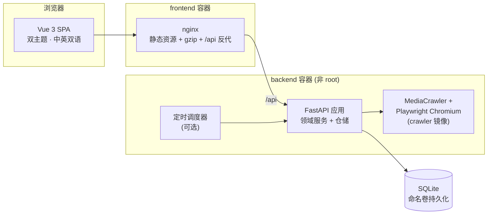

<div align="center">


# 网络风险情报 · Cyber Risk Intelligence

**EVIDENCE · ANALYZE · PROTECT**

面向互联网黑灰产风控的开源情报工作台 —— 从公开数据采集到证据交付的全链路

[](https://github.com/Oreapo/mediaspider-intel-platform/actions/workflows/ci.yml)


</div>

> **English** — Cyber Risk Intelligence is a full-stack investigation workbench for anti-black/grey-industry risk control: collect public data from Chinese social platforms, organize datasets, extract risk signals, cluster risk entities into gangs, manage cases, and export audit-ready evidence packets. FastAPI + Vue 3 + SQLite, fully dockerized.

---

## 目录

- [这是什么](#这是什么)
- [核心工作流](#核心工作流)
- [功能总览](#功能总览)
- [支持平台](#支持平台)
- [界面与体验](#界面与体验)
- [系统架构](#系统架构)
- [快速开始](#快速开始)
- [配置说明](#配置说明)
- [测试与质量](#测试与质量)
- [目录结构](#目录结构)
- [文档索引](#文档索引)
- [合规声明](#合规声明)

---

## 这是什么

**网络风险情报(Cyber Risk Intelligence)** 是一个自部署的情报分析平台,目标用户是互联网平台的**反黑灰产风控团队**。它把一次完整的风控调查所需的环节收敛到一个工作台里:

- 别再用爬虫脚本 + Excel + 聊天记录拼调查流程 —— 采集、研判、画像、处置在同一条流水线上;
- 每一步都**可追溯**:信号来自哪个数据集、案件关联了哪些实体、证据包对应哪条结论,全部留痕;
- 交付物是**结构化的证据包与报告**,而不是一堆截图。

典型场景:发现某平台上的**引流导流**、**灰产招募**、**欺诈推广**、**卖家/商品风险**团伙,固定证据并推动处置。

## 核心工作流

平台的信息架构收敛为 **5 个工作阶段**,数据沿流水线单向沉淀:

```
监测任务 ──▶ 数据集 ──▶ 风险信号 ──▶ 风险实体 / 团伙 ──▶ 案件 ──▶ 证据包 / 报告
 (采集)      (沉淀)      (研判)         (画像)          (处置)      (交付)
```

| 阶段 | 页面 | 做什么 |
| --- | --- | --- |
| 🛡 **风险态势** | 首页看板 | 高危信号 / 在办案件 / 采集健康度的 BI 总览,平台横向对比 |
| 📡 **监测任务** | 采集任务 | 统一任务模型管理多平台采集,定时调度、失败诊断、运行留痕 |
| 🔍 **线索研判** | 数据集 / 风险信号 | 数据预览筛选,信号提取(黑灰产专用提取器)、复核、确认 |
| 👥 **团伙画像** | 风险实体 | 账号 / 商品 / 卖家 / 联系方式聚合,关系构建与**团伙聚类** |
| 📁 **处置与案件** | 案件 / 证据包 / 报告 | 案件全生命周期(状态机 + 历史),一键生成可下载证据包 manifest |

## 功能总览

- **统一任务模型** —— 平台 / 场景 / 实体类型 / 模式(search、detail 等)一套模型描述所有采集任务,支持队列优先级与登录 Profile
- **弹性任务运行** —— 任务租约(lease)防重复执行,失败运行可诊断、可重跑
- **黑灰产信号提取器** —— 面向引流、招募、欺诈话术等场景的专用提取器,信号带风险评分与等级
- **信号复核流** —— new → reviewing → confirmed / dismissed,全程审计
- **实体与关系** —— 信号聚合成风险对象,支持手工建实体、建关系、**团伙聚类**
- **案件工作区** —— 数据集 / 信号 / 实体 / 分析输出 / 备注挂接到案件,状态流转带历史与审计
- **证据交付** —— 从案件生成可追溯的证据包 manifest;分析结果沉淀为情报报告
- **通知与审计** —— 通知规则、投递历史、站内收件箱;全平台操作审计事件
- **权限体系** —— 基于角色的访问控制(管理员 / 分析师),可选登录认证
- **持久化** —— SQLite 单文件存储 + JSON→SQLite 自动迁移,Docker 命名卷持久化

## 支持平台

内置以下平台的任务模板与信号提取能力(采集执行依赖外部授权的 MediaCrawler,见[合规声明](#合规声明)):

| | 平台 | | 平台 | | 平台 | | 平台 |
|---|---|---|---|---|---|---|---|
|  | 小红书 |  | 抖音 |  | 快手 |  | 哔哩哔哩 |
|  | 微博 |  | 百度贴吧 |  | 知乎 |  | 闲鱼 |

## 界面与体验

- 🎨 **双主题** —— 蓝 / 粉两套品牌主题一键切换,基于 CSS 设计令牌,持久化到本地
- 🌐 **中英双语** —— 完整的 i18n 词典,CI 中强制校验两种语言键位一致
- 📱 **自适应布局** —— 流式栅格,从笔记本到超宽屏自动铺排
- ✨ **定制组件** —— 玻璃拟态下拉框(键盘可达)、平台 logo 选择器、状态徽章、骨架屏加载态

## 系统架构



- **后端**:FastAPI + Pydantic,分层架构(接口 / 应用服务 / 领域 / 基础设施),仓储可按实体切换 JSON / SQLite
- **前端**:Vue 3 `<script setup>` + TypeScript + Vite,生产环境由 nginx 托管并反代 API
- **采集**:标准镜像不含浏览器;`Dockerfile.crawler` 变体内置 Playwright Chromium + CJK 字体,通过 additional build context 引入外部 MediaCrawler
- **镜像加固**:固定 UID 非 root 运行、内置 HEALTHCHECK、OCI 标签(详见 [docs/deployment.md](docs/deployment.md))

## 快速开始

### Docker(推荐)

```bash
git clone https://github.com/Oreapo/mediaspider-intel-platform.git
cd mediaspider-intel-platform
docker compose up --build
```

| 入口 | 地址 |
| --- | --- |
| Web 应用 | http://localhost:8080 |
| API 文档(Swagger) | http://localhost:8180/docs |
| 健康检查 | http://localhost:8180/health |

默认配置使用 SQLite 命名卷、**不要求登录**。对外暴露前请:`cp .env.example .env`,开启 `MEDIASPIDER_AUTH_REQUIRED`,替换示例密钥与账号。

需要真实采集能力时,叠加 crawler 编排文件(要求本地存在授权的 MediaCrawler 检出):

```bash
MEDIASPIDER_MEDIA_CRAWLER_HOST_PATH=/path/to/MediaCrawler \
docker compose -f docker-compose.yml -f docker-compose.crawler.yml up --build
```

### 本地开发

要求:Python ≥ 3.10,Node.js ≥ 20。

```powershell
# 安装依赖
python -m venv .venv
.venv\Scripts\python.exe -m pip install -r backend\requirements-dev.txt
npm --prefix frontend ci
Copy-Item .env.example .env

# 终端 1:启动后端(:8180)
.venv\Scripts\python.exe -m backend.app

# 终端 2:启动前端(:5200,自动代理 API)
npm --prefix frontend run dev
```

Linux / macOS 将 `.venv\Scripts\python.exe` 换成 `.venv/bin/python`、`Copy-Item` 换成 `cp` 即可。

## 配置说明

所有配置通过环境变量(前缀 `MEDIASPIDER_`)注入,常用项:

| 变量 | 默认值 | 说明 |
| --- | --- | --- |
| `MEDIASPIDER_AUTH_REQUIRED` | `false` | 是否强制登录 |
| `MEDIASPIDER_AUTH_SECRET` | `change-me` | 会话签名密钥,**生产必须替换** |
| `MEDIASPIDER_AUTH_USERS` | 示例账号 | `用户名:密码:角色:显示名`,逗号分隔多账号 |
| `MEDIASPIDER_REPOSITORY_MODE` | `sqlite`(Docker) | 存储引擎;支持按实体逐个覆盖 |
| `MEDIASPIDER_AUTO_MIGRATE_JSON` | `true`(Docker) | 首启时自动把历史 JSON 数据迁入 SQLite |
| `MEDIASPIDER_SCHEDULER_ENABLED` | `false` | 定时调度器开关 |
| `MEDIASPIDER_SCHEDULER_INTERVAL_SECONDS` | `60` | 调度扫描间隔 |
| `MEDIASPIDER_BACKEND_PORT` | `8180` | 后端对外映射端口(compose) |
| `MEDIASPIDER_MEDIA_CRAWLER_ROOT` | — | 外部 MediaCrawler 根目录(真实采集必需) |
| `MEDIASPIDER_MEDIA_CRAWLER_HOST_PATH` | `./vendor/MediaCrawler` | crawler 镜像构建时的 MediaCrawler 路径 |

完整清单见 [`.env.example`](.env.example) 与 [docs/deployment.md](docs/deployment.md)。

## 测试与质量

```powershell
.venv\Scripts\python.exe -m pytest backend\tests   # 170+ 后端测试
npm --prefix frontend run check:i18n               # 中英词典键位一致性
npm --prefix frontend run build                    # 类型检查 + 生产构建
```

GitHub Actions 在每次推送 `main` 时运行同样的三件套(见 [ci.yml](.github/workflows/ci.yml))。

## 目录结构

```
├── backend/                # FastAPI 应用
│   ├── app/                #   接口层 / 应用服务 / 领域 / 基础设施
│   ├── scripts/            #   启动、迁移、备份、MediaCrawler 桥接
│   ├── tests/              #   pytest 测试套件
│   ├── Dockerfile          #   标准镜像(非 root + healthcheck)
│   └── Dockerfile.crawler  #   含 Playwright Chromium 的采集镜像
├── frontend/               # Vue 3 SPA
│   ├── src/                #   视图 / 组件 / 组合式函数 / i18n
│   ├── public/brand/       #   品牌 logo(蓝 / 粉)
│   ├── public/platform-logos/  # 平台图标
│   └── nginx.conf          #   生产反代与缓存策略
├── data-contracts/         # 共享数据实体契约
├── docs/                   # 架构 / 部署 / 运维 / 产品文档
├── docker-compose.yml          # 标准部署编排
└── docker-compose.crawler.yml  # 采集能力叠加编排
```

## 文档索引

| 文档 | 内容 |
| --- | --- |
| [用户指南](docs/user-guide.md) | 平台工作流、功能模块、常见问题 |
| [部署指南](docs/deployment.md) | Docker / 裸机部署、crawler 镜像、数据卷 |
| [系统架构](docs/architecture.md) | 分层设计、模块边界 |
| [产品定位](docs/product-positioning.md) | ICP、核心场景、IA 收敛决策 |
| [反黑灰产设计](docs/anti-black-gray-design.md) | 场景模型、信号提取器、团伙聚类 |
| [统一任务模型](docs/unified-task-model.md) | 任务抽象与平台模板 |
| [数据库模型](docs/database-model.md) | 实体与表结构 |
| [持久化迁移](docs/persistence-migration.md) | JSON → SQLite 迁移机制 |

## 合规声明

> **本项目仅面向合法合规的风控与安全研究用途。**
>
> - 平台本身**不内置任何爬虫**;真实采集依赖使用者自行准备的、经授权的外部 [MediaCrawler](https://github.com/NanmiCoder/MediaCrawler) 检出,并遵守其许可证与目标平台的服务条款。
> - 使用者应确保数据采集与处理行为符合所在司法辖区的法律法规(包括但不限于个人信息保护相关规定),仅采集公开数据且用于打击黑灰产等正当目的。
> - 默认配置面向可信的内网 / 开发环境;对外部署前请务必开启认证并替换全部示例凭据。

---

<div align="center">
<sub>网络风险情报 · Cyber Risk Intelligence — Evidence. Analyze. Protect.</sub>
</div>
