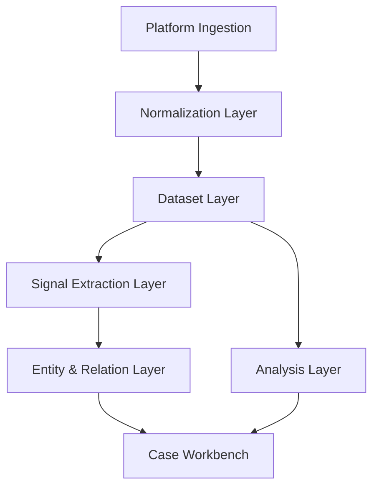

# Architecture

## 分层架构

## 1. Platform Ingestion

职责：

- 运行平台采集任务
- 管理登录态、分页、频控、失败重试
- 输出原始内容、评论、账号、商品、卖家记录

实现来源：

- 复用现有 `main.py`
- 复用 `media_platform/<platform>/`

## 2. Normalization Layer

职责：

- 将原始平台记录统一成标准实体
- 保存来源平台、采集时间、原始字段映射
- 为后续信号提取和跨平台关联提供稳定输入

建议统一实体：

- `content`
- `comment`
- `creator`
- `product`
- `seller`
- `price_snapshot`
- `account_alias`

## 3. Dataset Layer

职责：

- 组织原始采集批次
- 支持抽样、筛选、标签、版本化
- 作为风险分析的中间资产层

核心对象：

- `CollectionTask`
- `TaskRun`
- `Dataset`
- `DatasetSlice`

## 4. Signal Extraction Layer

职责：

- 提取暗语、招募语、引流语、规避词
- 检测异常价格、异常活跃度、异常发布时间
- 提取可疑联系方式、跳转路径、跨平台导流痕迹

核心输出：

- `Signal`
- `SignalRuleMatch`
- `RiskScore`

## 5. Entity & Relation Layer

职责：

- 将账号、卖家、商品、内容、评论映射成可关联对象
- 构建多平台关系图谱
- 支持“谁与谁有关、通过什么线索关联”

核心对象：

- `RiskEntity`
- `RelationEdge`
- `Observation`

## 6. Analysis Layer

职责：

- 执行通用反黑灰分析器
- 执行平台专属分析器
- 输出专题洞察、可视化数据和证据摘要

子层建议：

- `analysis/common/`
- `analysis/platforms/<platform>/`
- `analysis/cross_platform/`

## 7. Case Workbench

职责：

- 创建和维护案件专题
- 汇总数据集、信号、实体、关系、分析结果
- 输出调查结论和证据包

最终页面不应只停留在：

- Dashboard / Tasks / Datasets / Analysis

还应增加：

- `Signals`
- `Entities`
- `Cases`
- `Evidence`
