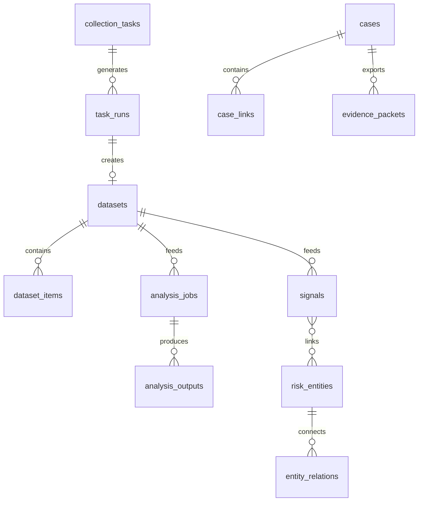

# Database Model

## 目标

数据库层不再只承载“任务、数据集、分析任务”，而要承载完整反黑灰对象体系：

1. 采集任务
2. 数据集
3. 风险信号
4. 风险实体
5. 关系图谱
6. 案件专题
7. 证据包

## 核心表设计

## `platform_profiles`

用途：

- 保存平台接入配置
- 保存默认登录方式、账号策略、平台能力描述

建议字段：

- `id`
- `platform`
- `profile_name`
- `auth_type`
- `credentials_ref`
- `settings_json`
- `created_at`
- `updated_at`

## `collection_tasks`

用途：

- 保存统一采集任务
- 与风险场景绑定

建议字段：

- `id`
- `task_name`
- `platform`
- `entity_type`
- `task_mode`
- `scenario_type`
- `status`
- `task_payload_json`
- `filter_payload_json`
- `runtime_payload_json`
- `storage_profile_json`
- `analysis_profile_json`
- `last_run_at`
- `created_at`
- `updated_at`

## `task_runs`

用途：

- 保存每次任务执行记录

建议字段：

- `id`
- `task_id`
- `status`
- `trigger_type`
- `started_at`
- `finished_at`
- `log_path`
- `result_dataset_id`
- `error_message`

## `datasets`

用途：

- 保存采集批次与标准化数据集目录

建议字段：

- `id`
- `dataset_name`
- `dataset_type`
- `source_platform`
- `source_task_id`
- `source_run_id`
- `scenario_type`
- `record_count`
- `storage_uri`
- `schema_version`
- `snapshot_time`
- `created_at`
- `updated_at`

## `dataset_items`

用途：

- 标准化后的单条记录索引

建议字段：

- `id`
- `dataset_id`
- `entity_type`
- `source_platform`
- `source_entity_id`
- `normalized_json`
- `raw_ref`
- `published_at`
- `collected_at`

## `signals`

用途：

- 保存风险信号

建议字段：

- `id`
- `dataset_id`
- `task_run_id`
- `signal_type`
- `signal_source`
- `risk_level`
- `risk_score`
- `summary`
- `payload_json`
- `status`
- `created_at`
- `updated_at`

## `risk_entities`

用途：

- 保存账号、卖家、商品、联系方式等统一风险实体

建议字段：

- `id`
- `entity_type`
- `display_name`
- `platform`
- `source_ref`
- `risk_score`
- `status`
- `profile_json`
- `created_at`
- `updated_at`

## `entity_relations`

用途：

- 保存实体关系边

建议字段：

- `id`
- `source_entity_id`
- `target_entity_id`
- `relation_type`
- `confidence`
- `evidence_ref_json`
- `created_at`

## `analysis_jobs`

用途：

- 记录分析任务

建议字段：

- `id`
- `dataset_id`
- `analysis_scope`
- `analysis_type`
- `status`
- `parameters_json`
- `started_at`
- `finished_at`
- `error_message`

## `analysis_outputs`

用途：

- 保存分析结果

建议字段：

- `id`
- `analysis_job_id`
- `output_type`
- `title`
- `summary`
- `payload_json`
- `created_at`

## `cases`

用途：

- 保存案件专题

建议字段：

- `id`
- `case_name`
- `case_type`
- `status`
- `priority`
- `summary`
- `owner`
- `created_at`
- `updated_at`

## `case_links`

用途：

- 保存案件与数据集、信号、实体之间的挂接关系

建议字段：

- `id`
- `case_id`
- `link_type`
- `target_id`
- `note`
- `created_at`

## `evidence_packets`

用途：

- 保存证据包元信息

建议字段：

- `id`
- `case_id`
- `packet_name`
- `storage_uri`
- `manifest_json`
- `created_at`
- `updated_at`

## 关系概览

## 数据存储建议

- 元数据：SQLite 起步，后续迁 PostgreSQL
- 原始记录：JSONL / 对象存储
- 证据快照：文件存储 + manifest 索引
- 关系图数据：先走关系表，后续再评估图库
